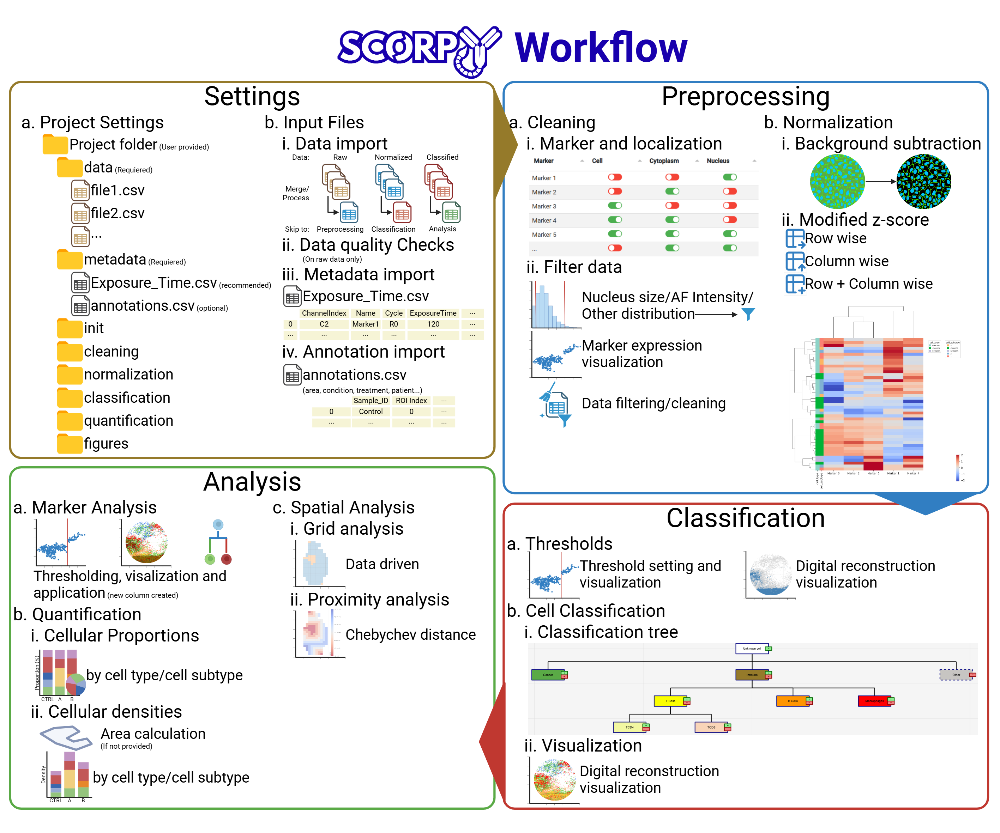

<p align="center">
  
</p>


<p align="center">
  A standalone, code-free desktop application for end-to-end analysis of<br/>
  Cyclic Immunofluorescence (CycIF) and CO-Detection by indEXing (CODEX) multiplexed imaging data.
</p>

<p align="center">
  <a href="https://github.com/marylab26/SCORPy/releases"></a>
  <a href="LICENSE"></a>
  
  
</p>

## Graphical abstract / Workflow

<p align="center">
  
</p>

## Table of Contents

- [Graphical abstract / Workflow](#graphical-abstract--workflow)
- [Table of Contents](#table-of-contents)
- [Overview](#overview)
  - [Key Features](#key-features)
  - [Highlights](#highlights)
- [Quick Start: Pre-built Executable](#quick-start-pre-built-executable)
- [Data Requirements](#data-requirements)
  - [Directory Structure](#directory-structure)
  - [Supported Input Formats](#supported-input-formats)
  - [Flexible Entry Points](#flexible-entry-points)
- [License](#license)
- [Citation \& Acknowledgments](#citation--acknowledgments)

## Overview

SCORPy provides a complete, guided analytical pipeline — from raw post-segmentation CSV files to spatial analysis — through an intuitive graphical interface. No coding or software installation required: download the executable and run.

### Key Features

| Module | Tab | Description |
|------|-----|-------------|
| Settings | 📍 **Instruction** | Global instructions and guidance |
| Settings | ⚙️ **Project Settings** | Set working directory; auto-creates output folders |
| Settings | 📂 **Input Files** | Import & merge raw CSVs, metadata, and annotations |
| Preprocessing | 🧹 **Cleaning**  | Quality control with quantile-based filtering and distribution plots |
| Preprocessing |🚧 **Normalization** | Background subtraction + modified z-score normalization |
| Classification | ✂️ **Thresholds** | Interactive dotplots with adjustable threshold sliders |
| Classification | 🎨 **Cell Classification** | Hierarchical decision tree for cell phenotyping |
| Analysis | 🔎 **Marker Analysis** | Post-classification marker exploration and binary column creation |
| Analysis | 📊 **Quantification** | Cellular proportions, tissue area, and density calculations |
| Analysis | 🧊 **Spatial Analysis** | Grid-based tissue partitioning & proximity mapping |

### Highlights

- **Code-free** — full GUI, no programming required
- **No installation** — download and run the standalone executable
- **Multi-format** — auto-detects CycIF, PhenoCycler (former CODEX) column formats
- **Scalable** — handles 500,000+ cells with memory-optimized processing
- **Reproducible** — export/import classification trees (JSON) and thresholds (CSV)
- **Cross-platform** — Windows, macOS, Linux

---

## Quick Start: Pre-built Executable 

1. Download the latest release from the [Releases page](https://github.com/marylab26/SCORPy/releases)
2. Run the executable:
   - **Windows:** double-click `SCORPy.exe`
   - **macOS / Linux:** `./SCORPy`
3. The application opens in a desktop window — no browser needed


---

## Data Requirements

### Directory Structure

Your project directory **must** contain two subfolders:

```
your_project/
  ├── data/                  # Raw CSV files (post-segmentation)
  │   ├── sample01.csv
  │   ├── sample02.csv
  │   └── ...
  ├── metadata/              # Metadata files
  │   ├── ometif.csv         # OME-TIFF (exposure times) — recommended
  │   └── annotations.csv    # Clinical annotations — optional
```

Once the project path is set, SCORPy auto-creates output directories (`init/`, `cleaning/`, `normalization/`, `classification/`, `quantification/`, `figures/`):

```
your_project/
  ├── data/
  │   ├── sample01.csv
  │   ├── sample02.csv
  │   └── ...
  ├── metadata/              
  │   ├── ometif.csv         
  │   └── annotations.csv    
  ├── init/                  # Merged raw data
  ├── cleaning/              # Cleaned data (per sample)
  ├── normalization/         # Normalized data
  ├── classification/        # Classified data
  ├── quantification/        # Final exports with binary columns
  └── figures/               # Heatmaps, trees, plots
```

### Supported Input Formats

SCORPy auto-detects intensity column naming conventions:

| Source | Column Pattern | Example |
|--------|----------------|---------|
| **Generic** | `Marker_Localization_Metric` | `CD3_Cell_Intensity_Average` |
| **CycIF** | `Marker Localization Metric` | `CD3 Cell Intensity Average` |
| **CODEX** | `Marker: Localization: Metric` | `CD3: Cell: Mean` |


Standard annotation columns (`Sample_ID`, `ROI_index`, `Nucleus_Size`, etc.) are recognized through an extensive alias list — see the **Instructions** tab in the app for full details.

### Flexible Entry Points

| Your data | Start at | Skip |
|-----------|----------|------|
| Raw post-segmentation CSVs | **Input Files** | — |
| Already normalized | **Thresholds** or **Cell Classification** | Cleaning + Normalization |
| Already classified | **Marker Analysis**, **Quantification**, or **Spatial Analysis** | All preprocessing |


---


## License

This project is licensed under the **MIT License** — see the [LICENSE](LICENSE) file for details.


---

## Citation & Acknowledgments

If you use SCORPy in your research, please cite:

```

```
 
- **Scientific Method:** Pr. *Marilyne Labrie*  
- **Developers:** *Zoé Gerber*, *Samuel Simard*, *Harshitha Kolipaka*
- **Final Development & UX Polish:** *Zoé Gerber*   
- **Contact:** [Marilyne Labrie](mailto:Marilyne.Labrie@USherbrooke.ca)
- **HORBITUS platform:** [Learn more](https://www.usherbrooke.ca/medecine/recherche/notre-caractere-distinctif/infrastructure-et-plateformes-de-la-recherche/horbitus)  
- **Documentation:**  Go see the **wiki** section
- A (huge) thank to all the beta testers and Labrie Lab members who provided kind feedback to improve the platform (Zacharie Drouin, Juliane Sévigny, Violaine Pourcel, Celia Crespo)
- A (special) thank to Zacharie Drouin for the awesome SCORPy logo !

---

<p align="center">
  Developed by the <a href="https://www.usherbrooke.ca/medecine/recherche/">Labrie Lab</a>, Université de Sherbrooke.
</p>
